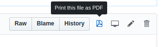

# Github UI Rewrite (Chrome Extension)

A Chrome extension for rewrite GitHub UI.

## Screenshots

:star: Print Markdown on Github as PDF (导出 Github 上的 Markdown 文档到 PDF):   

:star: Better display of repositories panel (更好地显示仓库面板):   
   

:star: Disable weird jump search (去掉奇怪的搜索):   
**This feature needs to be turned on manually (需要手动开启)**   
   

> I recommend another extension: **Awesome Autocomplete for GitHub** for auto completion of search   
> It looks like screenshot above. (这个插件的效果如上图)   
> <https://chrome.google.com/webstore/detail/djkfdjpoelphhdclfjhnffmnlnoknfnd>

## Install

1. `git clone`
2. Navigate to `chrome://extensions` in chrome.
3. Check `Developer mode` on, then click `Load Unpacked Extension`.
4. Choose this directory `extension`

## Contributing

1. Installing `node` and `npm` environment.
2. Executing `npm install`
3. Coding files in `src`
4. Executing `npm run build`/`npm run dev` to build scripts
5. Give me [Pull Request][PR]

## Author

[LiuYue @hangxingliu](https://github.com/hangxingliu/)

## License

Sources are licensed under the [GPL-3.0 License](LICENSE).

[PR]: https://github.com/hangxingliu/github-ui-rewrite/pulls
